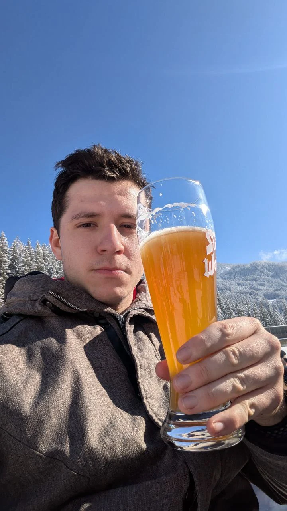
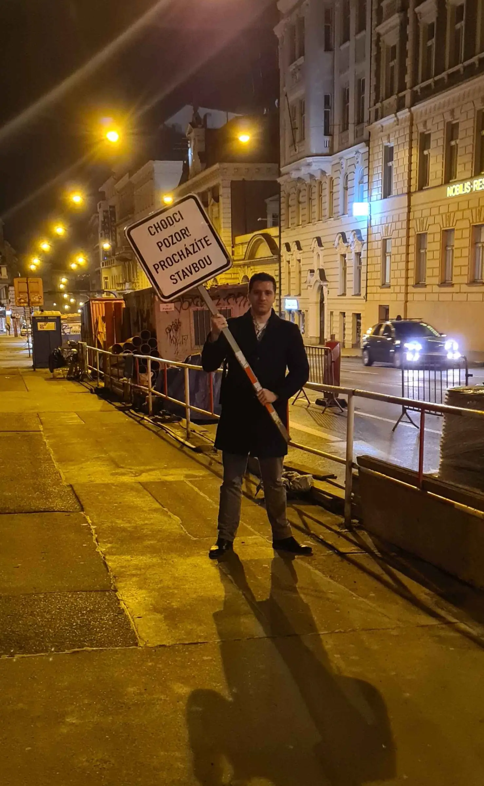

    
    

# About me (in short)
A student of graduate Cybernetics and robotics programme at FEE CTU in Prague.

Professional interrests: everything concerning low-level programming, HW design

Personal interrests: skiing, Après-ski, weight lifting a bit, definitely your favorite beer drinking specialist

