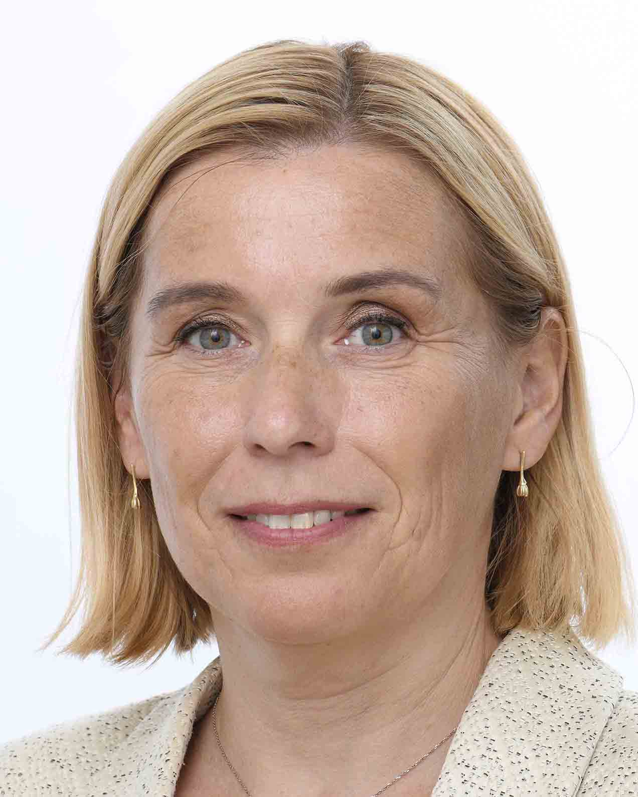
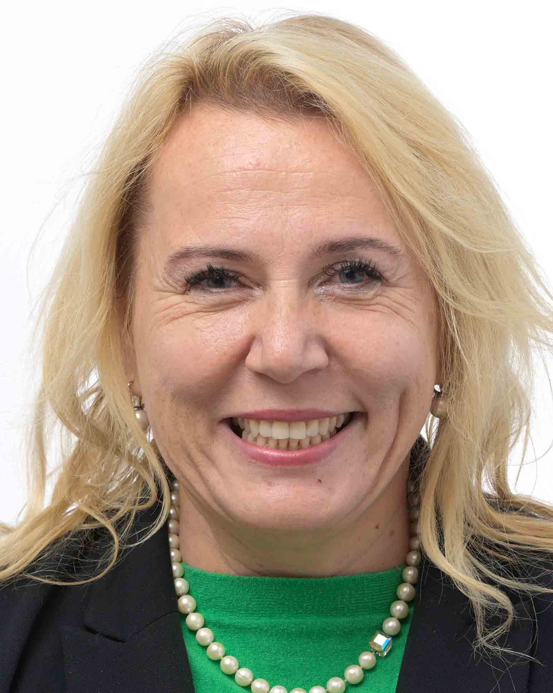
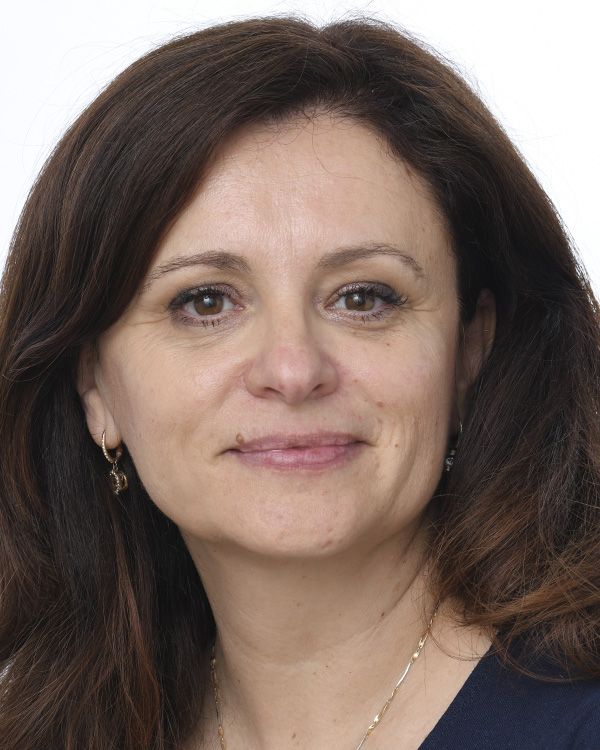
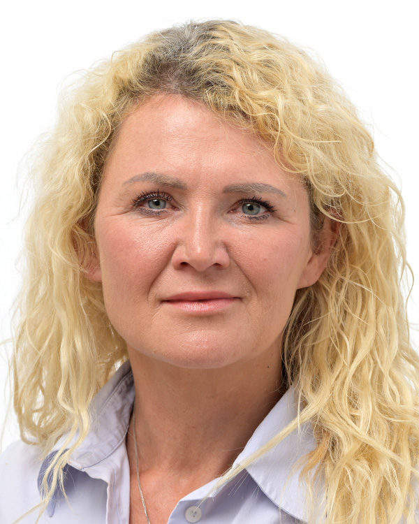
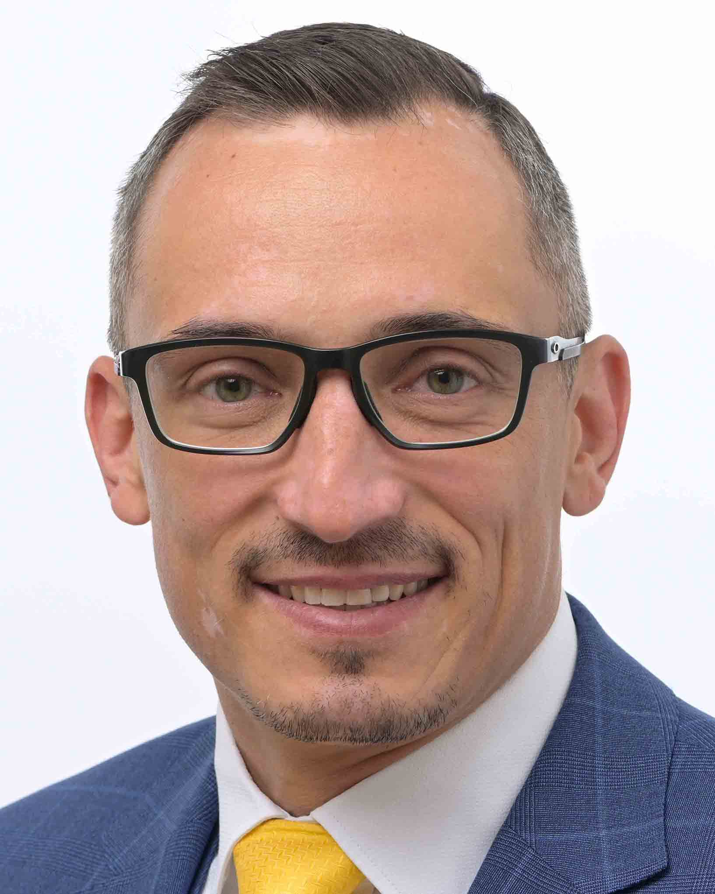
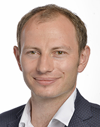



# About me (in short)
A student of graduate Cybernetics and robotics programme at FEE CTU in Prague.
Studied at Purdue in Indiana, USA in the 2026 Spring Semester.

Deeply passionate about embedded development (firmware and PCB design as well)
and real time operating systems, mostly NuttX (got several commits).
Professional interests include computer architectures,
operating systems, control engineering and robotics.

Personal interrests: skiing, Après-ski,
weight lifting a bit, definitely your favorite beer drinking specialist.
I am also a huge movie fan (crime, mysterious). Ask me anything about
the Godfather.

# Wall of Shame: Chat Control Traitors

> Update 09-08-2026: **Is still anyone talking about this? This needs to be reminded over and over.** 

These traitors voted for spying of your private messages.

On 7–9 July 2026, the European Parliament voted 331 in favour to 304 against (11 abstentions) to extend the "Chat Control 1.0" ePrivacy derogation, allowing platforms to scan private communications. These are the Czech MEPs who voted in favour.

Don't let other MEPs vote in favor of a law which is disguised as a good thing, but whose
implementation would open a way for private message spying!

| Photo | Name | Party |
|---|---|---|
|  | Danuše Nerudová | Starostové (STAN) |
|  | Jan Farský | Starostové (STAN) |
|  | Luděk Niedermayer | TOP 09 |
|  | Ondřej Kolář | TOP 09 |
|  | Tomáš Zdechovský | KDU-ČSL |
|  | Klára Dostálová | ANO |
|  | Jaroslava Jermanová | ANO |
|  | Jana Nagyová | ANO |
|  | Jaroslav Bžoch | ANO |
|  | Ondřej Knotek | ANO |
|  | Jaroslav Knot | ANO |

Sources:
- [EU to extend temporary message-scanning regime to detect child sexual abuse online (Euronews)](https://www.euronews.com/my-europe/2026/07/07/eu-to-extend-temporary-message-scanning-regime-to-detect-child-sexual-abuse-online)
- [Procedural Trick Before Summer Recess Pushes EU Parliament Towards Capitulation on "Chat Control" (Patrick Breyer)](https://www.patrick-breyer.de/en/procedural-trick-before-summer-recess-pushes-eu-parliament-towards-capitulation-on-chat-control/)
- [Parliament forced back to the chat control question (EU Perspectives)](https://euperspectives.eu/2026/07/parliament-forced-back-to-the-chat-control-question/)
- [Chat monitoring: Parliament extends exemption and limits scans (Table.Briefings)](https://table.media/en/europe/news-en/chat-monitoring-parliament-extends-exemption-and-limits-scans)

